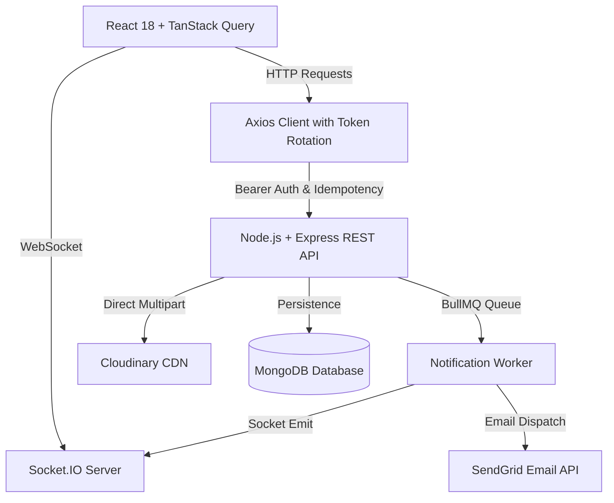

# Frontend API Integration & Architecture Guide

This document details the frontend architecture, API endpoint alignments (OpenAPI / Swagger 3.0 specs), Cloudinary media management, real-time Socket.IO synchronization, and the Notification Inbox ecosystem.

---

## 1. High-Level Architecture Overview

---

## 2. API Endpoints Alignment & Contracts

All requests are prefixed with `/api/v1` and handle Bearer JWT authentication via `withCredentials: true` and in-memory tokens.

### 2.1. Authentication Routes (`/auth`)

| Method | Endpoint | Description | Payload / Query |
| :--- | :--- | :--- | :--- |
| `POST` | `/auth/signup` | Register new account | `{ name, username, email, password }` |
| `POST` | `/auth/login` | Login user & issue JWT pair | `{ emailOrUsername, password }` |
| `POST` | `/auth/refresh-token` | Rotate expired Access Token | Cookie: `refreshToken` |
| `POST` | `/auth/logout` | Revoke session | `{ sessionId? }` |
| `GET` | `/auth/profile` | Get current user profile | Header: `Authorization: Bearer <token>` |
| `GET` | `/auth/sessions` | List all active device sessions | - |

---

### 2.2. Project Workspace Routes (`/projects`)

| Method | Endpoint | Description | Payload / Query |
| :--- | :--- | :--- | :--- |
| `GET` | `/projects` | Get projects where user is owner/member | - |
| `GET` | `/projects/created` | Get projects created by user | - |
| `POST` | `/projects` | Create a new project workspace | `{ name, description? }` |
| `GET` | `/projects/:projectId` | Get detailed workspace info & members | - |
| `GET` | `/projects/:projectId/activity` | Project activity timeline feed | - |
| `PUT` | `/projects/:projectId` | Update project name or description | `{ name?, description? }` |
| `DELETE` | `/projects/:projectId` | Soft delete project workspace | - |
| `POST` | `/projects/:projectId/archive` | Archive workspace | - |
| `POST` | `/projects/:projectId/invite` | Invite member (`ProjectManager` / `TeamMember`) | `{ emailOrUsername, role }` |
| `POST` | `/projects/:projectId/remove` | Remove member from workspace | `{ userId }` |

---

### 2.3. Task CRUD & Media Management Routes (`/projects/:projectId/tasks`)

| Method | Endpoint | Description | Payload / Query |
| :--- | :--- | :--- | :--- |
| `GET` | `/projects/:projectId/tasks` | Paginated tasks listing with filter | Query: `page`, `limit`, `status` |
| `POST` | `/projects/:projectId/tasks` | Create task (supports attachments & video) | `{ title, description?, assigneeId?, status?, images?, videoUrl? }` |
| `PATCH` | `/projects/:projectId/tasks/:taskId` | Update task details / status / attachments | `{ title?, description?, assigneeId?, status?, images?, videoUrl? }` |
| `POST` | `/projects/:projectId/tasks/upload` | Direct file upload (images/PDF/video) to Cloudinary | `multipart/form-data`: `file` or `files` |
| `DELETE` | `/projects/:projectId/tasks/attachments` | Delete media asset from Cloudinary & task | `{ publicId, resourceType?, taskId?, fileUrl? }` |
| `DELETE` | `/projects/:projectId/tasks/:taskId` | Soft delete task | - |
| `DELETE` | `/projects/:projectId/tasks/bulk` | Bulk soft delete multiple tasks | `{ taskIds: string[] }` |
| `GET` | `/projects/:projectId/tasks/:taskId/events` | Chronological event history for single task | - |
| `GET` | `/projects/:projectId/tasks/events` | Project-wide task event history | - |

#### Cloudinary Upload & Attachments Workflow
1. **Creation Stage**: When a user creates a task, they can attach multiple screenshots (PNG/JPEG) or PDF documents. Files are uploaded to `POST /projects/:projectId/tasks/upload` in parallel, returning Cloudinary secure URLs which are attached to the task's `images` array.
2. **Editing & Detaching**: Users can add new attachments at any time or remove existing attachments. When removing an attachment, `DELETE /projects/:projectId/tasks/attachments` removes the asset from Cloudinary storage and detaches the URL from the task in MongoDB.
3. **Demo Video Support**: Video demonstration URLs (Loom, YouTube, or direct MP4/Cloudinary video links) can be attached and edited on tasks, providing a direct link and player preview for reviews.

---

### 2.4. Notification Inbox Routes (`/notifications`)

| Method | Endpoint | Description | Payload / Query |
| :--- | :--- | :--- | :--- |
| `GET` | `/notifications` | Paginated user inbox | Query: `page`, `limit`, `isRead`, `type`, `projectId` |
| `GET` | `/notifications/unread-count` | Real-time unread badge count | - |
| `PATCH` | `/notifications/:notificationId/read` | Mark single notification as read | Sets `isRead: true` and `readAt: Date` in DB |
| `PATCH` | `/notifications/read-all` | Mark all notifications (or by project) as read | `{ projectId? }` |
| `DELETE` | `/notifications/:notificationId` | Delete single notification item | - |
| `DELETE` | `/notifications/clear-all` | Clear notifications (all or read-only) | Query: `readOnly=true/false` |

---

## 3. Real-Time Socket.IO Synchronization

The frontend maintains real-time WebSocket connectivity authenticated by the user's JWT.

### 3.1. Notification Events (Private User Room `user:${userId}`)
- `notification:new`: Triggered when a new notification is enqueued for the user.
  - UI Action: Increments unread counter badge, prepends notification to inbox list cache, and triggers a floating in-app toast alert.
- `notification:read`: Fired when a notification is marked read in any tab/session.
  - UI Action: Updates `isRead: true` and syncs unread count across all client tabs.
- `notification:read_all`: Fired when all notifications are marked read.
  - UI Action: Clears unread counter and marks list items as read.
- `notification:deleted`: Fired when a notification is removed.
  - UI Action: Removes notification from TanStack query cache.
- `notification:cleared`: Fired when read/all notifications are cleared.

### 3.2. Project Workspace & Kanban Events (Project Room `project:${projectId}`)
- `task:created`: Injects new task into Kanban board columns.
- `task:status_changed`: Moves task card to target column instantly.
- `task:updated`: Updates task title, description, attachments, or video URL.
- `task:deleted` & `task:bulk_deleted`: Removes deleted tasks from view.
- `workspace:evicted` & `member:removed`: Redirects evicted members back to Dashboard safely.

---

## 4. UI Components & Pages

### 4.1. Header & Navigation
- **Notification Bell Dropdown** (`NotificationDropdown.tsx`): Header icon displaying an animated badge counter with quick flyout showing the 6 most recent notifications, a "Mark all read" button, and a link to the full inbox.
- **In-App Live Toast** (`DashboardLayout.tsx`): Real-time banner that slides in on new incoming notifications with direct "Open Inbox" action.

### 4.2. Notification Inbox Page (`/dashboard/inbox` - `NotificationInbox.tsx`)
- Status tabs: **All**, **Unread**, **Read**.
- Category filter chips: **All Events**, **Tasks & Proofs**, **Workspaces**, **Team Members**.
- Workspace dropdown selector.
- Search input matching title, message, workspace name, or actor.
- Action toolbar: **Refresh**, **Mark All Read**, **Clear Read**.
- Click-to-open **Notification Detail Modal** (`NotificationDetailModal.tsx`):
  - Automatic `isRead: true` synchronization on modal open.
  - Displays full actor details, workspace tag, status transition diffs (`todo` -> `done`), and timestamps.
  - Direct button to navigate straight to the associated Project / Task Kanban board.

### 4.3. Enhanced Task Kanban Board (`KanbanBoard.tsx`)
- Task creation modal with Cloudinary file attachment picker (JPEG, PNG, PDF, Video) and Demo Video URL input.
- Task details modal:
  - Text editing (title, description).
  - Assignee and status selection.
  - Attachment gallery with thumbnail image preview lightbox, PDF document chip (with direct open in new tab), and file deletion from Cloudinary.
  - Demo video URL viewer and editor.
  - Audit event history timeline.

---

## 5. Admin Audit Console & Analytics (`/dashboard/admin/audit`)

Accessible strictly to users with `role === 'admin'`. Non-admin users are automatically guarded and redirected to `/dashboard`.

### 5.1. Admin API Route Contract

| Method | Endpoint | Description | Payload / Query |
| :--- | :--- | :--- | :--- |
| `GET` | `/audit` | Paginated system-wide audit event logs with multi-field search and filters | Query: `page`, `limit`, `resource`, `action`, `search`, `startDate`, `endDate` |

### 5.2. Admin Architecture & Components
- **Role Guard (`AdminRoute` in `App.tsx`)**: Enforces `user.role === 'admin'` check before mounting admin views. Non-admins receive an immediate redirect to `/dashboard`.
- **Sidebar Integration (`DashboardLayout.tsx`)**: The "Admin Console" navigation entry with shield icon is only rendered for authenticated admins.
- **Audit Dashboard (`AdminAuditDashboard.tsx`)**:
  - Live monitor mode (auto-refresh interval toggle).
  - Comprehensive filters: resource selector (`task`, `project`, `auth`, `user`, `notification`, `session`), action type selector (`CREATE`, `UPDATE`, `DELETE`, `LOGIN`, `LOGOUT`, etc.), time presets (Today, 7D, 30D, All Time), and full-text keyword search.
  - Tabular data viewer displaying timestamp, actor email/ID, HTTP action, target resource, IP address/user-agent, and status badge.
  - JSON audit stream export for compliance reporting.
- **Visual Analytics Charts (`AuditAnalyticsCharts.tsx`)**:
  - Total events, Unique Actors, Mutation rate, and Active Projects metric cards.
  - Daily/Hourly event volume distribution bar chart with interactive hovering.
  - Resource type breakdown progress bars.
- **State Diff Inspector (`AuditDetailModal.tsx`)**:
  - Actor metadata and IP geolocation/correlation IDs.
  - Side-by-side Before vs. After JSON state diffing for all update/delete mutations.
  - Direct clipboard copy of JSON logs.

---

## 6. Performance & Error Handling Strategy

1. **Optimistic Updates**: Immediate UI feedback on mark-as-read and status transitions prior to network completion.
2. **Network Resilience**: Automatic token rotation via Axios interceptors, request retry on transient network drops, and graceful fallback to cached TanStack query states.
3. **Lazy Loading & Code Splitting**: Heavy components (Audit charts, Kanban boards, and Modals) are structured with granular component tree separation for instantaneous route transitions.
4. **Strict Type Safety**: Full TypeScript schemas aligned directly with OpenAPI specifications.

