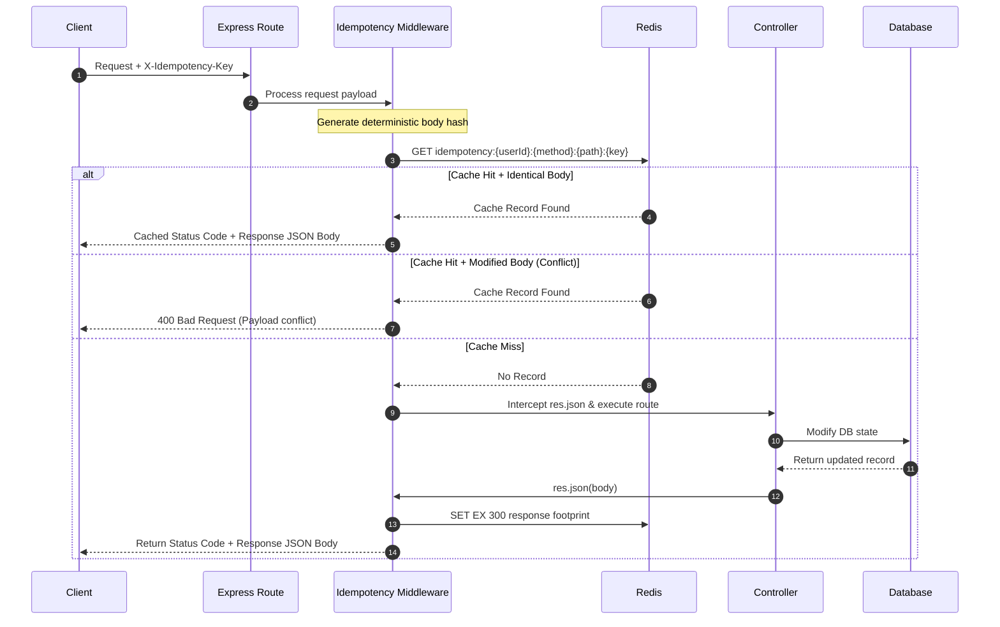

# Project Workspace Specification & API Documentation

This specification details the Project Workspace feature implementation including database models, API routing protocols, Zod validation payload structures, idempotency wrapper rules, and Socket.IO real-time subscriptions.

---

## 1. Data Models

### A. Project Schema (`project.model.ts`)
Each project document tracks its workspace attributes, owner metadata, member roles, and archived status.

- `projectId`: **UUID (String)**. The primary unique key used across endpoints and socket events.
- `name`: **String** (min 3 chars). Required.
- `description`: **String**. Optional.
- `owner`: **String (UUID)**. References `User.uuid.id`.
- `isArchived`: **Boolean** (default `false`).
- `isDeleted`: **Boolean** (default `false`).
- `members`: **Array** of subdocuments:
  - `userId`: **String (UUID)**. References `User.uuid.id`.
  - `role`: **String**. Options: `'ProjectManager'` or `'TeamMember'`.

### B. ProjectEvent Schema (`projectEvent.model.ts`)
Immutable audit log documents tracking chronological history.

- `eventId`: **UUID (String)**. Unique identifier.
- `projectId`: **String (UUID)**. References the workspace.
- `eventType`: **String**. Options:
  - `'PROJECT_CREATED'`
  - `'PROJECT_UPDATED'`
  - `'PROJECT_ARCHIVED'`
  - `'PROJECT_DELETED'`
  - `'MEMBER_INVITED'`
  - `'MEMBER_REMOVED'`
- `payload`: **Object (Mixed)**. Contains changes or invitee metadata.
- `actorId`: **String (UUID)**. User who initialized the action.
- `timestamp`: **Date** (default `Date.now`).

---

## 2. API Endpoints Reference

All project workspace routes require a bearer authorization header:
`Authorization: Bearer <Access_Token>`

Write-operations (mutations) support optional **Idempotency** caching headers:
`X-Idempotency-Key: <UUID>`

### A. List Workspaces (`GET /api/v1/projects`)
Returns projects where the user is an owner or a registered member.
- **Success Response (200)**:
  ```json
  {
    "success": true,
    "statusCode": 200,
    "message": "User project workspaces retrieved successfully",
    "data": [
      {
        "projectId": "8ea38a6a-d248-43df-973f-c399b38c2317",
        "name": "Acme Project Workspace",
        "description": "Design and build",
        "owner": "user-uuid-111",
        "members": [
          { "userId": "user-uuid-111", "role": "ProjectManager" }
        ],
        "isArchived": false,
        "createdAt": "2026-07-16T12:00:00Z"
      }
    ]
  }
  ```

### B. List Owned Workspaces (`GET /api/v1/projects/created`)
Returns project workspaces where the user is the owner (creator).
- **Success Response (200)**:
  ```json
  {
    "success": true,
    "statusCode": 200,
    "message": "Owned project workspaces retrieved successfully",
    "data": [
      {
        "projectId": "8ea38a6a-d248-43df-973f-c399b38c2317",
        "name": "Acme Project Workspace",
        "description": "Design and build",
        "owner": "user-uuid-111",
        "members": [
          { "userId": "user-uuid-111", "role": "ProjectManager" }
        ],
        "isArchived": false,
        "createdAt": "2026-07-16T12:00:00Z"
      }
    ]
  }
  ```

### C. Create Workspace (`POST /api/v1/projects`)
Create a new project workspace. The creator automatically becomes the owner and is added as a member with the `'ProjectManager'` role.
- **Request Body**:
  ```json
  {
    "name": "Acme Project Workspace",
    "description": "Optional details here"
  }
  ```
- **Success Response (201)**:
  ```json
  {
    "success": true,
    "statusCode": 201,
    "message": "Project workspace created successfully",
    "data": {
      "projectId": "8ea38a6a-d248-43df-973f-c399b38c2317",
      "name": "Acme Project Workspace",
      "description": "Optional details here",
      "owner": "user-uuid-111",
      "members": [
        { "userId": "user-uuid-111", "role": "ProjectManager" }
      ],
      "isArchived": false
    }
  }
  ```

### D. Get Workspace Details (`GET /api/v1/projects/:projectId`)
Returns details of a specific workspace. Restricts access to members.
- **Success Response (200)**:
  ```json
  {
    "success": true,
    "statusCode": 200,
    "message": "Project workspace details retrieved successfully",
    "data": {
      "projectId": "8ea38a6a-d248-43df-973f-c399b38c2317",
      "name": "Acme Project Workspace",
      "isArchived": false,
      "members": [ ... ]
    }
  }
  ```

### E. Update Workspace (`PUT /api/v1/projects/:projectId`)
Requires `'ProjectManager'` role in the workspace.
- **Request Body**:
  ```json
  {
    "name": "Updated Workspace Name",
    "description": "Updated Description"
  }
  ```
- **Success Response (200)**:
  ```json
  {
    "success": true,
    "statusCode": 200,
    "message": "Project workspace updated successfully",
    "data": { ... }
  }
  ```

### F. Archive Workspace (`POST /api/v1/projects/:projectId/archive`)
Requires `'ProjectManager'` role. Prevents updates and member invitations on archived projects.
- **Success Response (200)**:
  ```json
  {
    "success": true,
    "statusCode": 200,
    "message": "Project workspace archived successfully",
    "data": { ... "isArchived": true }
  }
  ```

### G. Delete Workspace (`DELETE /api/v1/projects/:projectId`)
Requires `'ProjectManager'` role.
- **Underlying Logic**:
  - If the project contains 0 tasks, it is permanently deleted (`deleteOne`) from MongoDB.
  - If the project has tasks, it is soft-deleted/archived (`updateOne({ isDeleted: true })`) and all its tasks are soft-deleted.
- **Success Response (200)**:
  ```json
  {
    "success": true,
    "statusCode": 200,
    "message": "Project workspace deleted successfully",
    "data": null
  }
  ```

### H. Invite Workspace Member (`POST /api/v1/projects/:projectId/invite`)
Requires `'ProjectManager'` role. Looks up the user by email or username, appends them to the members collection, and triggers Socket.IO synchronization.
- **Request Body**:
  ```json
  {
    "emailOrUsername": "developer_jane",
    "role": "TeamMember"
  }
  ```
- **Success Response (200)**:
  ```json
  {
    "success": true,
    "statusCode": 200,
    "message": "Member invited successfully to workspace",
    "data": { ... "members": [ ... ] }
  }
  ```

### I. Remove Workspace Member (`POST /api/v1/projects/:projectId/remove`)
Requires `'ProjectManager'` role. Evicts user from workspace and terminates their active socket session from the project room. Workspace owners cannot be removed.
- **Request Body**:
  ```json
  {
    "userId": "target-user-uuid"
  }
  ```
- **Success Response (200)**:
  ```json
  {
    "success": true,
    "statusCode": 200,
    "message": "Member removed successfully from workspace",
    "data": { ... }
  }
  ```

### J. Timeline Activity Log (`GET /api/v1/projects/:projectId/activity`)
Chronological history timeline of all mutations. Returns detailed actor profiles (name, username, email).
- **Success Response (200)**:
  ```json
  {
    "success": true,
    "statusCode": 200,
    "message": "Project timeline activity retrieved successfully",
    "data": [
      {
        "eventId": "event-uuid-1",
        "projectId": "8ea38a6a-d248-43df-973f-c399b38c2317",
        "eventType": "PROJECT_CREATED",
        "payload": { "name": "Acme Project Workspace", ... },
        "actorId": "user-uuid-111",
        "timestamp": "2026-07-16T12:00:00.000Z",
        "actor": {
          "name": "Admin User",
          "username": "admin",
          "email": "admin@example.com"
        }
      }
    ]
  }
  ```

---

## 3. Real-Time Synchronization (Socket.IO)

### Room Management (`join_project` event)
- Clients must subscribe to real-time events by emitting a `join_project` event after authenticating:
  ```javascript
  socket.emit("join_project", { projectId: "8ea38a6a-d248-43df-973f-c399b38c2317" });
  ```
- The backend validates project membership.
- If authorized, the client is subscribed to room `project:${projectId}` and receives `project:joined`.

### Emitted Events (Broadcasted to Room members)
- `project:updated` (name/description edits)
- `project:archived` (project marked archived)
- `project:deleted` (workspace deleted)
- `member:invited` (new user added to members array)
- `member:removed` (user removed from members array)

### Eviction Control
- When a user is removed via `POST /api/v1/projects/:projectId/remove`, the backend searches active connections, removes the client's socket connection from the room `project:${projectId}` automatically, and emits a private event:
  - Event: `"workspace:evicted"`
  - Payload: `{ projectId }`
- On receiving `"workspace:evicted"` or `"member:removed"` (for the current user) on any active socket channel (including `useTaskSocketSync` on the Kanban Board page), the frontend:
  1. Purges the cached query query state: `queryClient.removeQueries(["project-tasks", projectId])`.
  2. Instantly redirects the user to the dashboard page: `navigate("/dashboard")`.

---

## 4. Postman Integration Configuration

Copy the configurations below to define Postman requests.

### 1. Create Project Workspace
- **Method**: `POST`
- **URL**: `{{baseUrl}}/api/v1/projects`
- **Headers**:
  - `Authorization`: `Bearer {{accessToken}}`
  - `X-Idempotency-Key`: `{{$guid}}`
- **Body (raw JSON)**:
  ```json
  {
    "name": "Phoenix Rebirth Engine",
    "description": "Next-gen deployment scheduler"
  }
  ```

### 2. Update Project Workspace
- **Method**: `PUT`
- **URL**: `{{baseUrl}}/api/v1/projects/:projectId`
- **Headers**:
  - `Authorization`: `Bearer {{accessToken}}`
  - `X-Idempotency-Key`: `{{$guid}}`
- **Body (raw JSON)**:
  ```json
  {
    "name": "Phoenix Rebirth v2",
    "description": "Refined deployment pipeline engine"
  }
  ```

### 3. Invite Team Member
- **Method**: `POST`
- **URL**: `{{baseUrl}}/api/v1/projects/:projectId/invite`
- **Headers**:
  - `Authorization`: `Bearer {{accessToken}}`
  - `X-Idempotency-Key`: `{{$guid}}`
- **Body (raw JSON)**:
  ```json
  {
    "emailOrUsername": "member_jane",
    "role": "TeamMember"
  }
  ```

### 4. Remove Team Member
- **Method**: `POST`
- **URL**: `{{baseUrl}}/api/v1/projects/:projectId/remove`
- **Headers**:
  - `Authorization`: `Bearer {{accessToken}}`
  - `X-Idempotency-Key`: `{{$guid}}`
- **Body (raw JSON)**:
  ```json
  {
    "userId": "Jane-User-UUID-Here"
  }
  ```

### 5. Fetch Workspace Timeline
- **Method**: `GET`
- **URL**: `{{baseUrl}}/api/v1/projects/:projectId/activity`
- **Headers**:
  - `Authorization`: `Bearer {{accessToken}}`

---

## 5. System Design: Production-Grade Idempotency Engine

To resolve duplicate request issues arising from client retry storms without compromising data integrity, the system implements a middleware-driven **Unified Response Envelope Idempotency Engine**.



### Core Components

#### A. Key Namespace Isolation
To prevent collision between different users, HTTP methods, and target endpoints, tracking keys in Redis are generated using the following pattern:
`idempotency:{userId}:{method}:{path}:{idempotencyKey}`
* `userId`: Resolves to the authenticated user UUID `req.user.uuid.id` (or `anonymous` if unauthenticated).
* `method`: The HTTP verb (e.g., `POST`, `PUT`, `DELETE`).
* `path`: The absolute path of the target endpoint excluding query parameters (e.g., `/api/v1/projects/8ea38a6a-d248-43df-973f-c399b38c2317/archive`).
* `idempotencyKey`: The raw key extracted from the `X-Idempotency-Key` header.

#### B. Cryptographic Payload Signature Integrity
To prevent request tampering (submitting different parameters while reusing an existing key), the middleware recursively and deterministically sorts keys of the request body and constructs a **SHA-256** checksum hash of the stringified payload.
* If a cache record is found but the stored hash does not match the newly calculated hash, the server immediately rejects the request with a `400 Bad Request` error: `"Idempotency Key conflict: Request payload has changed."`

#### C. Unified Response Envelope Strategy
The middleware caches the entire HTTP footprint rather than raw database models:
```json
{
  "bodyHash": "6b86b273ff34fce19d6b804eff5a3f5747ada4eaa22f1d49c01e52ddb7875b4b",
  "statusCode": 201,
  "responseBody": {
    "success": true,
    "statusCode": 201,
    "message": "Project workspace created successfully",
    "data": { ... }
  }
}
```
This is stored in Redis with a Time-To-Live (TTL) of **300 seconds (5 minutes)**.

#### D. Non-Blocking Fail-Open Mode
If Redis is down or unreachable during the cache lookup, the engine logs the error to `stderr` and executes `next()` to allow the controller to serve the request. This preserves API availability at the cost of temporary idempotency degradation.


---

## 6. Tasks & Task Event-Sourcing API Documentation

### A. Create Task (`POST /api/v1/projects/:projectId/tasks`)
Creates a new task.
- **Zod Validation Body**:
  - `title`: String (1-200 chars). Required.
  - `description`: String (max 2000 chars). Optional.
  - `assigneeId`: String (UUID). Optional.
  - `status`: Enum (`todo`, `inprogress`, `underreview`, `done`). Optional.

### B. Update Task (`PATCH /api/v1/projects/:projectId/tasks/:taskId`)
Updates details of a task (title, description, assignee, status).
- **Zod Validation Body**:
  - `title`: String (1-200 chars). Optional.
  - `description`: String (max 2000 chars). Optional/Nullable.
  - `assigneeId`: String (UUID). Optional/Nullable.
  - `status`: Enum (`todo`, `inprogress`, `underreview`, `done`). Optional.
- **Success Response (200)**: Returns the updated task object enriched with assignee profile details (name, username, email).
- **Real-Time Sockets**: Emits a `task:updated` event to the project socket room, containing the full enriched task. If status changes, also emits a `task:status_changed` event.

### C. Fetch Task Timeline (`GET /api/v1/projects/:projectId/tasks/:taskId/events`)
Returns the chronological activity events logged for the specific task.
- **Event Types Logged**:
  - `TASK_CREATED`
  - `TASK_UPDATED` (logs `field`, `previousValue`, `newValue`)
  - `ASSIGNEE_CHANGED` (logs `previousAssigneeId`, `newAssigneeId`)
  - `STATUS_CHANGED` (logs `previousStatus`, `newStatus`)

### D. Bulk Delete Tasks (`DELETE /api/v1/projects/:projectId/tasks/bulk`)
Soft-deletes multiple tasks at once.
- **Zod Validation Body**:
  - `taskIds`: Array of valid UUID strings. Min length 1.
- **WebSocket Broadcast**: Emits `task:bulk_deleted` to the project room containing `{ taskIds, projectId, actorId }`.

---

## 7. Authentication & Token Expirations Spec
- **Access Token (JWT)**: Valid for **4 hours** (`"4h"`).
- **Refresh Token (Cookie)**: Valid for **7 days** (`"7d"` / `7 * 24 * 60 * 60 * 1000` ms). Saved in secure HTTP-only cookies.

---

## 8. Resilient Project Archiving Spec
- When a Project delete is triggered (`DELETE /api/v1/projects/:projectId`):
  - **No Tasks Case**: If the project has 0 tasks inside, it is permanently deleted from the database.
  - **Has Tasks Case**: If the project has tasks inside, it is archived instead:
    - Project's `isDeleted` field is set to `true`.
    - All tasks belonging to the project are soft-deleted (`isDeleted: true`).
  - **UI Display**: Archived projects are displayed under a dedicated "Archived Projects" tab on the Workspace Dashboard, with open board redirect actions disabled.

